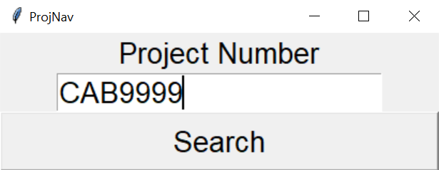

# Project Navigator
Project Navigator, short as, ProjNav, is a simple tkinter app the opens a "Project Folder" in Windows Explorer on a "Project Number" input. 
A "Project Number" in this scenario is a string that starts with "CAB", "CON", "HSK" or "ITN", then follows by 4 or more digits. 

# Prerequisites
For the sake of convenience, the prerequisite directories have been hard coded just for my personal use. 
This app will only work on Windows. 

# Running the tests
Enter a "Project Number" in the Entry box, then press "Enter" key or click the "Search" button to navigate to the "Project Folder".
It will open the said "Project Folder" or raise an error if the "Project Number" format is not valid or the the said "Project Number" does not exist. 

